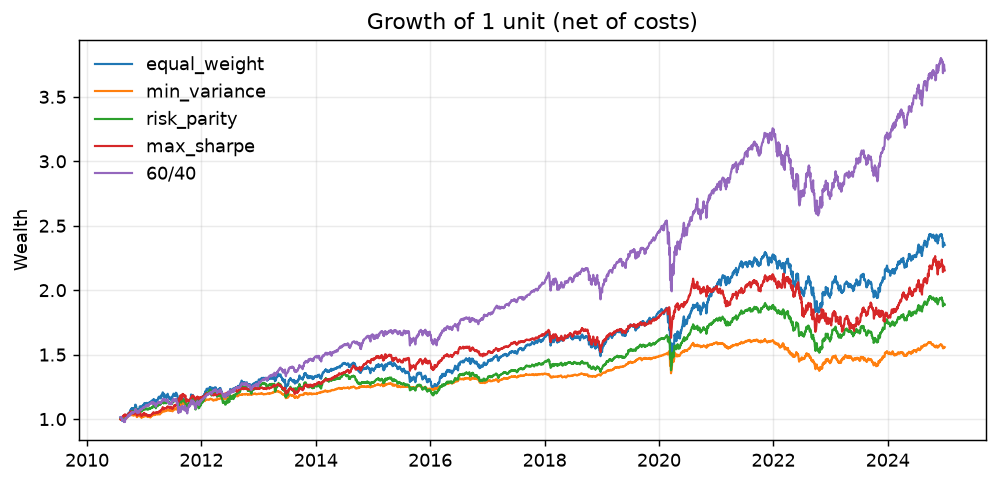

# portfolio-lab

Multi-asset portfolio construction, risk analytics and backtesting on a ten-ETF universe.


## Results

Out-of-sample, monthly rebalanced, **net of 5 bps transaction costs**, from 2010-08.
Sharpe and Sortino are **excess of the thirteen-week Treasury bill**, which averaged 1.54%
over this window and ranged from -0.11% to 5.50%.

| Strategy | CAGR | Volatility | Sharpe | Sortino | Max drawdown | Turnover p.a. |
| --- | --- | --- | --- | --- | --- | --- |
| 60/40 benchmark | 9.93% | 10.32% | 0.82 | 1.15 | -21.63% | 0.18 |
| Equal weight | 7.40% | 10.47% | 0.59 | 0.82 | -23.21% | 0.29 |
| Minimum variance | 3.53% | 4.61% | 0.44 | 0.61 | -15.11% | 0.35 |
| Risk parity | 5.68% | 8.17% | 0.53 | 0.74 | -20.26% | 0.45 |
| Maximum Sharpe | 7.61% | 9.08% | 0.68 | 0.95 | -21.15% | 2.02 |

Not one of the four rules beats a static 60/40 on risk-adjusted return, and measuring
against cash rather than against zero is what makes that legible: it costs every strategy
between 0.14 and 0.33 of Sharpe, and it costs the low-volatility rules most, because a
minimum-variance book earning 3.53% while bills paid 1.54% has given up most of its edge
to the riskless leg.



The benchmark is the top line and it is not close. That is the result: four textbook
allocation rules, each of them defensible, none of them beating the simplest possible
portfolio over this window. The chart is drawn from the frozen fixture, which ends
2024-12-30, so it stops earlier than the live table above.

Full report with charts, tail risk and stress tests: [`reports/portfolio.html`](reports/portfolio.html).

These figures come from a live run and will drift as more history accumulates.
`tests/fixtures/expected_metrics.json` freezes the same computation to 2024-12-30, so a
reader can reproduce that snapshot offline, without network access, even as the numbers
above keep moving.

## Method

- **Universe**: ten liquid ETFs across equity (SPY, IWM, EFA, EEM), rates (AGG, TLT, HYG)
  and real assets (GLD, VNQ, DBC). ETFs rather than single stocks, because an ETF does not
  disappear: the universe carries **no survivorship bias**.
- **Estimation**: 36-month rolling window, Ledoit-Wolf shrinkage towards a scaled identity
  target, implemented from the 2004 paper rather than imported.
- **Rebalancing**: monthly, at the last trading day. Weights decided on day *d* apply from
  day *d+1*.
- **Costs**: 5 bps charged on turnover, where turnover is the sum of absolute weight
  changes. Every figure in the results table above is net.
- **Benchmarks**: 60/40 SPY/AGG and equal weight. No strategy is reported without both.

### Look-ahead bias

A strategy is a function `(date, history) -> weights`. The engine hands it a copy of the
trailing estimation window ending at `date` and nothing else, so a strategy cannot read the
future even if its author tries to. `tests/test_engine.py` contains a spy strategy that
records the latest observation it was shown; the test asserts it never exceeds the decision
date. The guarantee is enforced by the interface, not by convention.

## Limitations

Stated because they matter more than the headline numbers.

- **The 2008 crisis is not in the out-of-sample backtest.** HYG listed in April 2007, so the
  common history starts 2007-07; the first 36 months are consumed by the estimation window,
  so the backtest itself only begins 2010-07 (first weights decided 2010-07-30, first return
  recorded 2010-08-02).
- **The stress tests are how 2008 is covered**, by applying each strategy's *final* weights
  to the realized asset returns of a historical crisis window. These are counterfactuals on
  the current allocation, not performance the strategy lived through: the weights are held
  constant across the whole window, equivalent to rebalancing back to them daily at no cost.
  Unlike every other figure in this repository, the stress figures are **not** net of
  transaction costs.
- **The stress figures depend on when you run them**, because they replay the strategy's
  *final* weights, and those weights change as new history arrives. Concretely: the live run
  behind the results table above puts the 2008 loss for `min_variance` at **-13.97%**, while
  the frozen fixture ending 2024-12-30 gives **-4.5%** for the same strategy and the same
  scenario. Same code, same method, different as-of date — a reader who compares the two
  without this note would reasonably conclude something is broken.
- **No slippage or market impact model.** Transaction costs are a flat spread on turnover.
  Realistic for ten large ETFs at small size, optimistic at scale.
- **Maximum Sharpe uses in-sample expected returns** and is included precisely to make its
  instability visible next to the other rules, not as a recommendation.
- **The riskless leg is the three-month bill, and it is a bill, not the funding rate any
  particular investor faces.** FRED's `DTB3` is quoted on a bank-discount basis; `cash.py`
  converts it once to the bond-equivalent yield, which is the number an investor earns on
  the price paid, so the conversion is removed rather than disclosed. What remains
  disclosed: a real book funds at a spread to bills, not at bills, and no such spread is
  modelled here. The series was `^IRX` until Yahoo began serving it with about a month of
  history, which is not enough to cover a backtest that starts in 2007.
- **Dividends** are handled through adjusted close prices, which assumes reinvestment at
  close with no tax.
- **The Cornish-Fisher expansion degrades on daily returns with high excess kurtosis.**
  The correction is a truncated series around the Gaussian quantile; on a fat-tailed
  sample the quartic kurtosis term can dominate and the reported figure can exceed the
  empirical (historical) VaR at the same level by 2-3x. Past a kurtosis threshold the
  expansion leaves its region of validity altogether and the adjusted quantile can flip
  sign, reporting a gain where the sample clearly has a loss. `cornish_fisher_var` checks
  for this and raises rather than return a nonsensical figure — it is not, in general, a
  safe substitute for the historical VaR/ES pair on real portfolio return series.

## Running it

```bash
python -m venv .venv
.venv/bin/pip install -e ".[dev]"
.venv/bin/python -m plab --output reports/portfolio.html
```

Prices are cached under `cache/`; pass `--refresh` to re-download.

The price panel comes from a vendor whose recent tail is sometimes incomplete: a session
can be missing for one ETF and present for the rest, and July 2026 had three such days
across AGG, DBC, EEM, EFA, HYG and VNQ. Nothing is forward-filled to paper over it, so the
run refuses and names the dates. Pass `--end` to run on the intact history instead:

```bash
.venv/bin/python -m plab --end 2026-07-20 --output reports/portfolio.html
```

The flag cuts the bill series to the same window, so the two never drift apart.

## Tests

```bash
.venv/bin/python -m pytest --cov=src/plab
```

The suite runs offline against a frozen price fixture, so the published numbers are
reproducible without network access. The bill series is frozen alongside the prices and the
regression test runs the pipeline with it, because pinning a Sharpe measured against zero
while the report shows one measured against cash would go green on numbers nobody
publishes.

## Related

Four companion studies, same method: a frozen capture, a rendered report, and a
limitations section longer than the results.

- [rates-lab](https://github.com/emiliensabathier/rates-lab) — what the yield curve prices: policy path, inflation, term premium
- [valuation-lab](https://github.com/emiliensabathier/valuation-lab) — what a share price already assumes, by inverting a DCF
- [credit-lab](https://github.com/emiliensabathier/credit-lab) — which default score flags first, against real credit events
- [options-lab](https://github.com/emiliensabathier/options-lab) — what S&P 500 implied volatility prices: an arbitrage-free surface and the variance premium

## License

MIT.
